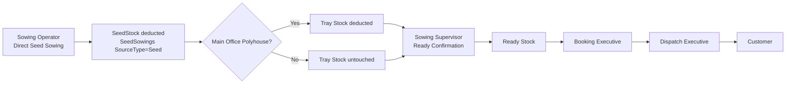
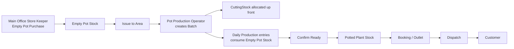
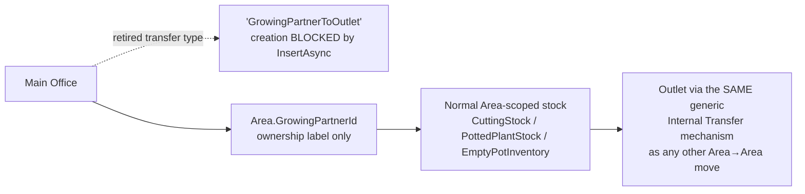
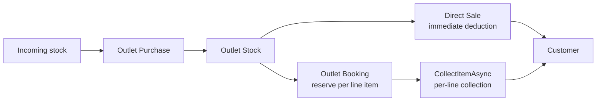
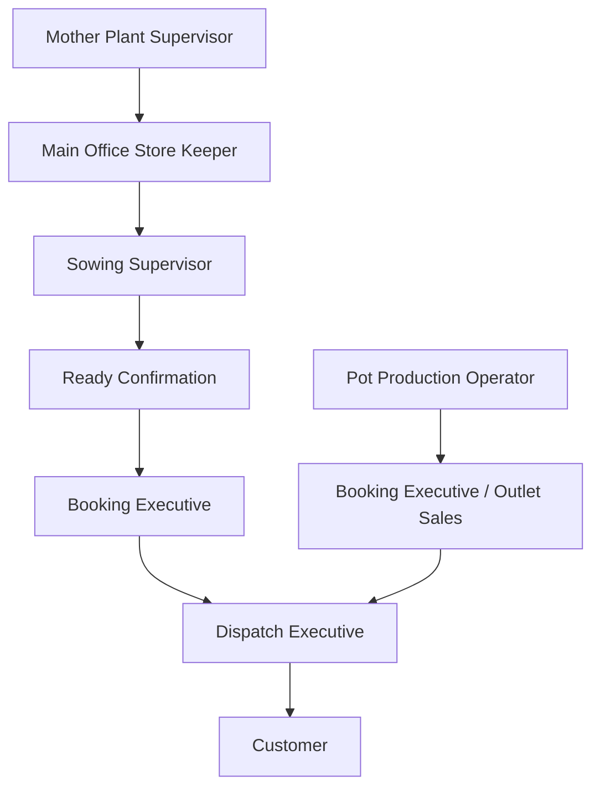
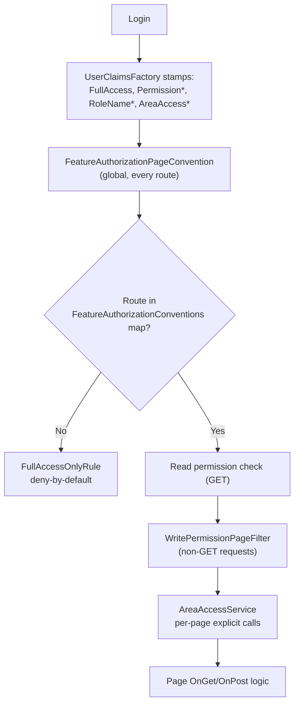
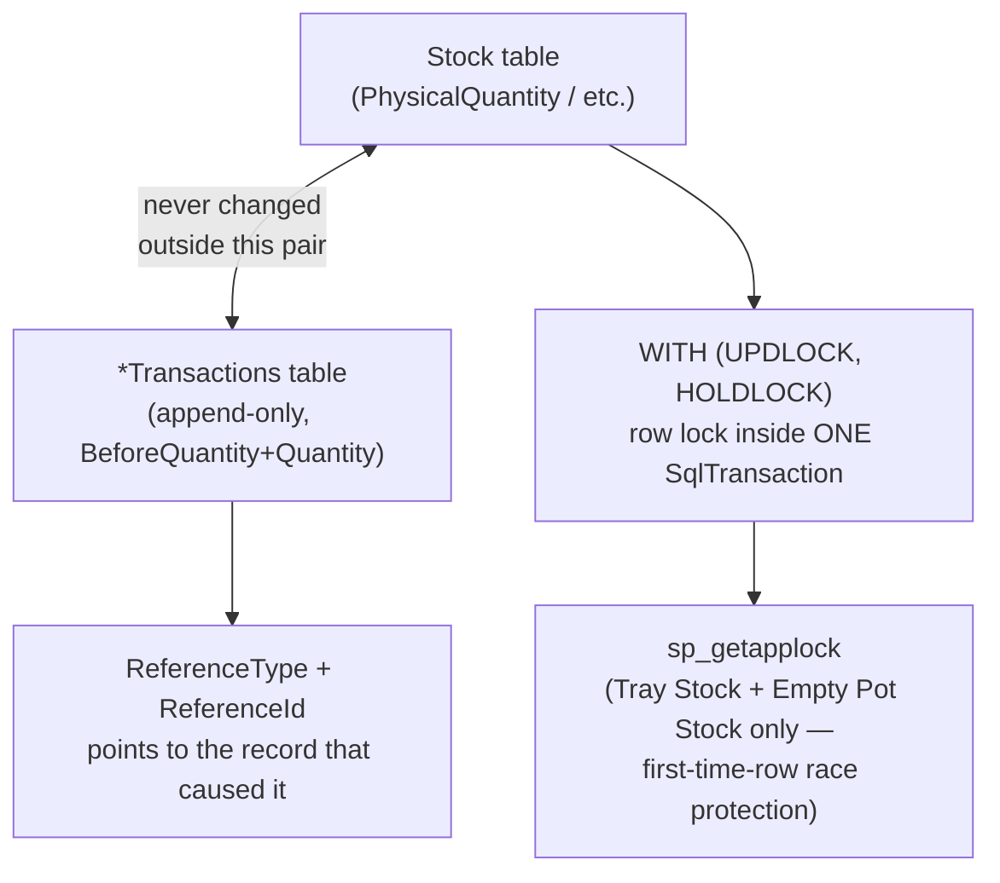
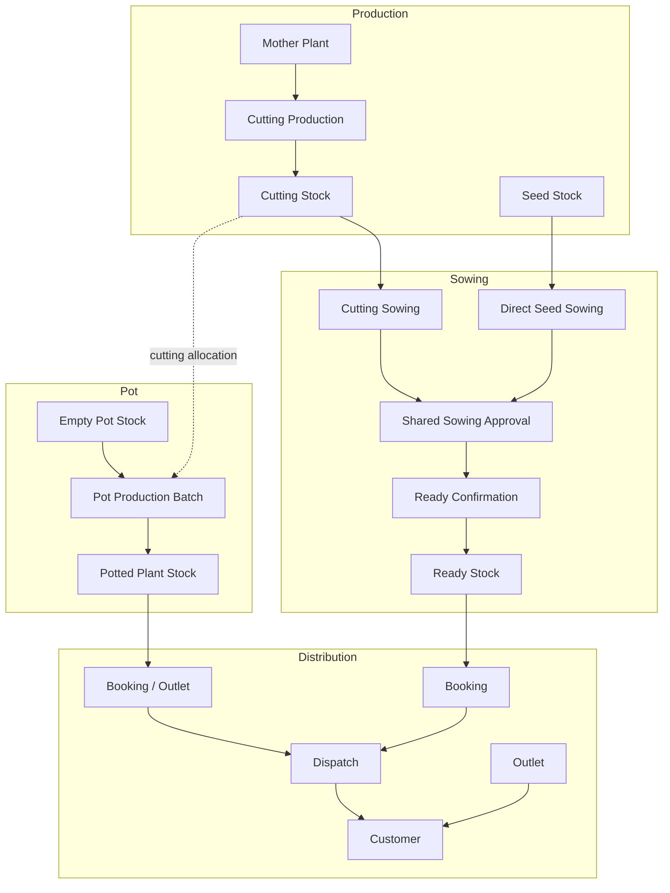

# PlantStockManager — Complete Role-Wise Workflow Documentation

> **Source of truth**: this document reflects the CURRENT code, CURRENT database schema, CURRENT navigation (`Pages/Shared/_Layout.cshtml`), and CURRENT role/permission data in `PlantsIMS2_Test` as of 2026-10-02. Where an older design existed and was superseded (e.g. the original two-step Cutting Sowing destination flow), only the current design is documented — the old one is mentioned only to say it no longer exists. Every claim is tagged `[VERIFIED BY CODE]`, `[VERIFIED WITH SQL]`, `[VERIFIED BY AUTOMATED TEST]`, or `[NOT VERIFIED]`. Nothing in this document was invented to fill a gap — where something isn't implemented, it is stated as not implemented.

---

## 1. Executive Summary

PlantStockManager is an ASP.NET Core Razor Pages + SQL Server nursery/production management system. Its backbone is two parallel sowing pipelines (Direct Seed Sowing and Cutting Sowing) that both feed one shared Sowing Approval → Ready Confirmation → Ready Stock pipeline, plus a parallel Pot Production pipeline, all surrounded by stock ledgers (Seed, Cutting, Tray, Empty Pot, Potted Plant, Ready Stock) and a generic Internal Transfer mechanism that moves stock between Areas.

**The single most important correction this document makes to any prior assumption**: the role names "Admin," "Management," "MotherPlantSupervisor," "MainOfficeOfficer," "KunjirSupervisor," "KiranSupervisor," "OutletSupervisor," and "LabWorker" **do not exist verbatim** in the current system. The real roles are **System Administrator**, **Mother Plant Supervisor**, **Main Office Store Keeper**, **Sowing Supervisor**, **Sowing Operator**, **Pot Production Operator**, **Outlet Sales**, **Booking Executive**, **Dispatch Executive**, **Fertilizer Supervisor**, **Purchase Officer**, and **Office Coordinator** — 12 roles in total `[VERIFIED WITH SQL]`. There is no role called "Management"; the Management Dashboard is gated by a single admin-only permission (`Admin.ManageAreas`), not a role. "Kunjir," "Kiran," and "Lab" exist only as **permission codes with zero roles holding them** — those three feature areas are reachable today only by a full-access System Administrator.

The system is built on a consistent architectural pattern: a stock table (physical balance) paired one-to-one with an append-only transaction ledger, every multi-step operation wrapped in one SQL transaction, and — as of this session — two newly-fixed concurrency gaps (Tray Stock and Empty Pot Stock first-time-allocation races) closed with `sp_getapplock`. Two real, confirmed gaps remain open at the time of writing: Direct Seed Sowing and Booking creation have no protection against an accidental double-click (unlike Cutting Production and Internal Transfer creation, which do), and Lab/Kunjir/Kiran permission codes are currently unreachable by any real role.

---

## 2. Current Role List — Assumed vs. Actual

`[VERIFIED WITH SQL]` against `dbo.Roles` / `dbo.RolePermissions` / `dbo.UserRoles`:

| # | Assumed name (brief) | **Actual role name** | Users assigned | Core permissions held |
|---|---|---|---|---|
| 1 | Admin | **System Administrator** | 2 | None needed — full-access bypass (`IsSystemRole=1`) |
| 2 | Management | *(no such role)* | — | Management Dashboard = `Admin.ManageAreas` only, held by nobody except via the System Administrator bypass |
| 3 | MotherPlantSupervisor | **Mother Plant Supervisor** | 6 | `MotherPlant.Enter/View`, `ReadyStock.Confirm/View`, `Outlet.Sell` |
| 4 | MainOfficeOfficer | **Main Office Store Keeper** | 1 | `MainOffice.Confirm/View`, `Sowing.Enter/View` |
| 5 | KunjirSupervisor | *(no such role)* | — | `Kunjir.View/Enter` exist as permission codes, granted to **zero roles** |
| 6 | KiranSupervisor | *(no such role)* | — | `Kiran.View/Enter` exist as permission codes, granted to **zero roles** |
| 7 | OutletSupervisor | **Outlet Sales** | 2 | `Outlet.View/Sell/Purchase/Confirm` |
| 8 | LabWorker | *(no such role)* | — | `Lab.View/Enter` exist as permission codes, granted to **zero roles** |
| 9 | Management | *(covered above)* | — | — |
| 10 | — | **Sowing Supervisor** (not in the brief at all) | 3 | `MainOffice.Confirm` — the role eligible to be a Direct Seed Sowing's assigned supervisor |
| 11 | — | **Sowing Operator** | 3 | `MainOffice.Confirm/View`, `Sowing.Enter/View`, `Dispatch.Enter` |
| 12 | — | **Pot Production Operator** | 0 | `PotProduction.Enter/View` |
| 13 | — | **Booking Executive** | 3 | `Booking.View/Enter` |
| 14 | — | **Dispatch Executive** | 1 | `Dispatch.Enter/View` |
| 15 | — | **Fertilizer Supervisor** | 1 | `Fertilizer.*` |
| 16 | — | **Purchase Officer** | 1 | `Purchase.View/Enter` |
| 17 | — | **Office Coordinator** | 2 | broad read access (`SeedStock.View`, `ReadyStock.View`, `Reports.View`, `Booking.View`, `Dispatch.View`) |

`[VERIFIED BY CODE]` **Code-vs-data conflict, documented rather than silently merged**: `Authorization/AreaAccessService.cs:54` hardcodes `FullAccessRoleNames = { "Admin", "Management", "MainOfficeOfficer" }` with a comment describing these as existing roles that need cross-Area reach. **None of these three strings match any current role name.** This means **Main Office Store Keeper does not actually receive the cross-Area access its own code comment says it needs** — see Workflow Gaps (§17.A.1).

---

## 3. Role-Wise Workflow

### 3.1 System Administrator

**A. Role Purpose**: the only full-access role. Bypasses every permission and every Area check application-wide (`ClaimsPrincipalSecurityExtensions.cs`, `AreaAccessService.cs:60-62`) via a `FullAccess` claim. Used in practice for user/role/area administration, master data, and the Management Dashboard — not a stock-moving role itself.

**B. Login → Dashboard Flow**
```
LOGIN → DASHBOARD (/index) → every nav section visible unconditionally → Admin menu, Management Dashboard, and every Production page all reachable
```

**C. Menu / Page Access**
| Section | Page | Route | View | Create | Edit | Delete/Cancel | Approve/Confirm | Area Restricted | Notes |
|---|---|---|---|---|---|---|---|---|---|
| Master Data & Admin | Users | `/Admin/Users` | ✅ | ✅ | ✅ | — | — | No | `Admin.ManageUsers` |
| Master Data & Admin | User Roles | `/Admin/UserRoles` | ✅ | ✅ | ✅ | — | — | No | `Admin.ManageUsers` |
| Master Data & Admin | Roles / Permissions | `/Admin/Roles` | ✅ | ✅ | ✅ | — | — | No | `Admin.ManageRoles` |
| Master Data & Admin | Areas | `/Admin/Area` | ✅ | ✅ | ✅ | — | — | No | `Admin.ManageAreas` |
| Master Data & Admin | Polyhouses | `/Admin/Polyhouse` | ✅ | ✅ | ✅ | — | — | No | `Admin.ManageAreas` |
| Master Data & Admin | Plant / Variety Master | `/Admin/Plant` | ✅ | ✅ | ✅ | — | — | No | `Admin.ManageMasters` |
| Master Data & Admin | Pot Sizes | `/Admin/PotSizes` | ✅ | ✅ | ✅ | — | — | No | `Admin.ManageMasters` |
| Master Data & Admin | Seed Sources | `/Admin/Seedsource` | ✅ | ✅ | ✅ | — | — | No | `Admin.ManageMasters` |
| Purchase | Vendors | `/Admin/Vendor` | ✅ | ✅ | — | — | — | No | `Purchase.View/Enter` — shared with Purchase Officer, not Admin-exclusive |
| Master Data & Admin | **Growing Partner Master** | — | — | — | — | — | — | — | **Does not exist as a page** — see §3.x Growing Partner |
| Reports | Management Dashboard | `/ManagementDashboard/Index` | ✅ (admin only) | — | — | — | — | No | `Admin.ManageAreas` — see §3.2 |
| *(every Production page)* | — | — | ✅ | ✅ | ✅ | ✅ | ✅ | No | bypasses every check |

**D. Data Entry Workflow** (example: creating a user)
```
ADMIN opens /Admin/Users → enters Username/Password/Name/Designation
  ↓ SYSTEM VALIDATES username uniqueness
  ↓ DATABASE: INSERT dbo.IMSUsers (IsActive=1)
  ↓ opens /Admin/UserRoles → assigns Role(s) + optional AreaId per assignment
  ↓ DATABASE: INSERT dbo.UserRoles (UserId, RoleId, AreaId)
  ↓ NEXT LOGIN (or next revalidation, every 5 minutes — SecurityOptions.PrincipalRevalidationMinutes): claims re-stamped from current RolePermissions/UserRoles
```
No batch number, no stock ledger, no approval step — pure master-data CRUD.

**E. Stock Workflow**: none of its own — uses the same Production pages as every other role when it does touch stock.

**F. Approval/Confirmation Workflow**: none of its own; can open any approval screen because every permission is bypassed.

---

### 3.2 "Management" (not a role — a single gated screen)

**A. Role Purpose**: there is no role named Management. `/ManagementDashboard/Index` requires exactly **`Admin.ManageAreas`** `[VERIFIED BY CODE, Authorization/FeatureAuthorizationConventions.cs:59, comment: "unchanged: Phase L administrator-only decision"]`. No role in `dbo.RolePermissions` currently holds `Admin.ManageAreas` — only System Administrator (via bypass) can open it `[VERIFIED WITH SQL]`. **Document this exactly as implemented**: Management Dashboard is an administrator screen, not a reporting surface for a distinct business persona.

**B–F**: read-only aggregated dashboard; no create/edit/approve capability of its own (see §13 Reporting Workflow for its data sources).

---

### 3.3 Mother Plant Supervisor (Cutting portion)

**A. Role Purpose**: records the physical cutting harvest from a specific Mother Plant and sends it to Main Office. Does **not** choose a sowing destination, Tray Cavity, or Sowing Supervisor for the eventual sowing — that moved entirely to whoever confirms the Cutting Sowing.

**B. Login → Dashboard Flow**
```
LOGIN → DASHBOARD → "Mother Plant & Cutting" menu
```

**C. Menu / Page Access**
| Section | Page | Route | View | Create | Edit | Delete/Cancel | Approve/Confirm | Area Restricted | Notes |
|---|---|---|---|---|---|---|---|---|---|
| Mother Plant & Cutting | Mother Plants | `/Production/MotherPlant/Index` | ✅ | ✅ | ✅ | — | — | ✅ (own Area) | `MotherPlant.View/Enter` |
| Mother Plant & Cutting | Cutting Production | `/Production/Cutting/Create` | — | ✅ | — | — | — | ✅ | `MotherPlant.Enter` |
| Mother Plant & Cutting | Cutting Production (list) | `/Production/Cutting/Index` | ✅ | — | — | — | — | ✅ | broad view |
| Sales / Distribution | Outlet (Direct Sale) | `/Production/OutletSale/*` | — | ✅ | — | — | — | — | `Outlet.Sell` — a deliberate cross-role grant |
| Seed Production | Sowing Approvals | `/Production/ReadyConfirmation/Confirm/{id}` | ✅ | — | — | — | ✅ (if assigned) | only if assigned supervisor | `ReadyStock.Confirm` — can approve Cutting sowings it is assigned to, **including its own** |

**D. Data Entry Workflow**
```
USER ENTERS: Mother Plant, Quantity, Supervisor (responsible person for this batch), Destination ("Main")
  ↓ SYSTEM VALIDATES: supervisor eligible for this Mother Plant's Area; destination re-derived server-side (never trusted from the post)
  ↓ DATABASE TRANSACTION (CuttingProductionRepository.InsertAsync): credit CuttingStock (Harvest) + insert InternalTransfers row — ONE transaction
  ↓ STOCK LEDGER: CuttingStockTransactions ('Harvest')
  ↓ NEXT STATUS: InternalTransfers.Status = PendingConfirmation
```
Idempotency: a `SubmissionToken` (GUID, one per form render) + unique index + `SqlException` 2601/2627 fallback makes a genuine accidental double-click unable to create two deliveries `[VERIFIED BY CODE]`.

**E. Stock Workflow**: produces cuttings into `CuttingStock` (its own growing Area); immediately transfers the full quantity onward as an `InternalTransfers` row. No reservation or dispatch concept at this stage.

**F. Approval/Confirmation Workflow**: does not confirm its own delivery; **can** be assigned as Sowing Supervisor for a downstream Cutting sowing and self-approve it (allowed for Cutting, explicitly disallowed for Seed — see §3.5).

---

### 3.4 Main Office Store Keeper (Cutting / Tray Stock portion)

**A. Role Purpose**: receives cutting deliveries, confirms actually-received quantity, records the Cutting Sowing (Polyhouse, Cavity, Supervisor on one screen), and allocates Tray Stock.

**B. Login → Dashboard Flow**
```
LOGIN → DASHBOARD → "Mother Plant & Cutting" menu (Confirm Receipt, Cutting Stock, Confirm Cutting Sowing, Tray Stock, Allocate Trays)
```

**C. Menu / Page Access**
| Section | Page | Route | View | Create | Edit | Delete/Cancel | Approve/Confirm | Notes |
|---|---|---|---|---|---|---|---|---|
| Mother Plant & Cutting | Confirm Cutting Receipt | `/Production/CuttingStock/PendingConfirmations`, `/ConfirmReceipt/{id}` | ✅ | — | — | — | ✅ | `MainOffice.Confirm` |
| Mother Plant & Cutting | Cutting Stock | `/Production/CuttingStock/Index` | ✅ | — | — | — | — | broad view |
| Mother Plant & Cutting | Confirm Cutting Sowing | `/Production/SeedSowing/CreateFromCutting` | — | ✅ | — | — | — | `Sowing.Enter` |
| Mother Plant & Cutting | Tray Stock | `/Production/TrayStock/Index`, `/Allocate` | ✅ | ✅ (Allocate) | — | — | — | `MainOffice.Confirm` for Allocate |

**D. Data Entry Workflow (Confirm Receipt)**
```
USER ENTERS: received quantity (+ optional discrepancy reason)
  ↓ SYSTEM VALIDATES: Status still PendingConfirmation, row-locked
  ↓ DATABASE TRANSACTION (ConfirmReceiptAsync): source −ConfirmedQuantity ('Transfer'), source −TransitLoss ('TransitLoss'), destination +ConfirmedQuantity ('Transfer')
  ↓ NEXT STATUS: InternalTransfers.Status = Completed; redirect carries transferId+cuttingStockId into Confirm Cutting Sowing
```

**E. Stock Workflow**: receives cuttings into Main Office `CuttingStock`; at Confirm Cutting Sowing, cuttings leave (`Sown`) and physical trays leave `TrayStock` (`Sowing`, Main Office Polyhouse destinations only); produces trays via Allocate.

**F. Approval/Confirmation Workflow**: confirms receipt (status-guarded against double-confirm); *records* the sowing (creation, not the approval itself — approval happens later at Ready Confirmation by the assigned Sowing Supervisor).

---

### 3.5 Sowing Supervisor / Sowing Operator (Direct Seed Sowing)

**A. Role Purpose**: records and/or approves Direct Seed Sowing from Main Office Seed Stock.

**Real eligibility rule** `[VERIFIED BY CODE]`: `DirectSowingRules.ValidateSupervisorAssignment` requires the `SupervisorId` to (a) differ from the recorder, and (b) hold the role literally named **"Sowing Supervisor"** (`UserRoleRepository.GetSowingApproversAsync`) — a **role-based** rule, different from Cutting Sowing's **permission-based** rule (any `ReadyStock.Confirm` holder in the same Area). Live data: only Akshay Shinde, Maya Shinde, Somnath Kadam hold "Sowing Supervisor" `[VERIFIED WITH SQL]`.

**C. Menu / Page Access**
| Section | Page | Route | View | Create | Edit | Delete/Cancel | Approve/Confirm | Notes |
|---|---|---|---|---|---|---|---|---|
| Seed Production | Seed Stock | `/Production/SeedStock/*` | `SeedStock.View` | `SeedStock.Enter` | `SeedStock.Enter` | — | — | |
| Seed Production | Direct Seed Sowing | `/Production/SeedSowing/Create`, `/Edit` | `Sowing.Enter` | `Sowing.Enter` | `Sowing.Enter` (survivorship fields only) | Cancel handler on Edit | — | |
| Seed Production | Sowing Approvals | `/Production/ReadyConfirmation/Confirm/{id}` | ✅ | — | — | — | ✅ (role holders only) | |

**D. Data Entry Workflow**
```
USER ENTERS: seed lot, quantity, cavity, sowing date, Area/Polyhouse (optional for Seed), Supervisor
  ↓ SYSTEM VALIDATES: whole number, lot is active Main Office Seed Stock, supervisor eligible, variety has ReadyStockDays configured
  ↓ DATABASE TRANSACTION: lock seed lot → insert SeedSowings → deduct SeedStock (Sown + auto-Wastage for remainder) → consume Tray Stock if Main Office Polyhouse
  ↓ STOCK LEDGER: SeedStockTransactions, TrayStockTransactions
  ↓ NEXT STATUS: Sown
```

**E. Stock Workflow**: consumes `SeedStock` (Physical only — no InTransit/Reserved concept here); consumes Tray Stock conditionally.

**F. Approval/Confirmation Workflow**: the recorder **can never** be the supervisor for a Seed sowing (own-sowing guard, stricter than Cutting's rule).

---

### 3.6 Pot Production Operator

**A. Role Purpose**: runs Pot Production batches (cutting + empty-pot consumption → potted plants).

**C. Menu / Page Access**
| Section | Page | Route | View | Create | Edit | Delete/Cancel | Approve/Confirm | Notes |
|---|---|---|---|---|---|---|---|---|
| Pot Production | Pot Production Batches | `/Production/PotBatch/*` | `PotProduction.View` | `PotProduction.Enter` | `PotProduction.Enter` | Cancel (pre-production only) | Confirm Ready (Area-based grant, not a single role) | |
| Pot Production | Empty Pot Stock | `/Production/EmptyPotInventory/Index` | broad view | — | — | — | — | |
| Pot Production | Empty Pot Purchase | `/Production/EmptyPotInventory/Purchase` | — | `Purchase.Enter` | — | — | — | Main Office only |
| Pot Production | Issue Empty Pots to Area | `/Production/EmptyPotInventory/Issue` | — | `InternalTransfer.Enter` | — | — | — | |
| Pot Production | Potted Plant Stock | `/Production/PottedPlantStock/Index` | broad view | — | — | — | — | |

**D. Data Entry Workflow**
```
USER ENTERS: source Cutting pool, quantity, species, pot size, destination Area/Polyhouse, empty pot pool, supervisor
  ↓ SYSTEM VALIDATES: stock availability, Area authorization
  ↓ DATABASE TRANSACTION: lock cutting pool → create batch → deduct cuttings (allocated to the whole batch up front)
  ↓ STOCK LEDGER: CuttingStockTransactions ('Potted')
  ↓ Status = InProduction
  ↓ daily AddEntryAsync calls: deduct empty pots incrementally ('Consumption'), NOT cuttings (already allocated)
  ↓ ConfirmReadyAsync: credit PottedPlantStock ('Production'), optionally return unused cuttings ('ReversalReturn'), Status → Ready (or Lost if ReadyQuantity=0)
```

**E. Stock Workflow**: consumes Cutting Stock (up front) and Empty Pot Stock (incrementally); produces Potted Plant Stock on Confirm Ready.

**F. Approval/Confirmation Workflow**: Confirm Ready authorization is **Area-based**, not tied to this specific role — any active user granted Ready-confirmer authority for the batch's own Area.

---

### 3.7 Outlet Sales

**A. Role Purpose**: runs the Outlet counter — receives stock, sells directly, handles Outlet bookings for later collection, records Outlet wastage.

**C. Menu / Page Access**
| Section | Page | Route | View | Create | Edit | Delete/Cancel | Approve/Confirm | Notes |
|---|---|---|---|---|---|---|---|---|
| Outlet | External Purchase | `/Production/OutletPurchase/Create` | — | `Outlet.Purchase` | — | — | — | |
| Outlet | Direct Sale | `/Production/OutletSale/Create`, `/Index` | `Outlet.View` | `Outlet.Sell` | — | — | — | immediate stock deduction, **no reservation step** |
| Outlet | Customer Booking | `/Production/OutletBooking/Create`, `/Index`, `/Details` | `Outlet.View` | `Outlet.Sell` | — | Cancel | Collect-per-line-item (`Outlet.Sell`) | line-item collection model, see §7 |
| Outlet | Record Wastage | `/Production/OutletWastage/Create` | — | `Outlet.Sell` | — | — | — | shares the Sell permission, no separate wastage permission |

**D. Data Entry Workflow (Direct Sale)**
```
USER ENTERS: species/pot size/quantity/customer
  ↓ SYSTEM VALIDATES: stock availability
  ↓ DATABASE TRANSACTION: OutletSales insert + PottedPlantStock deduction
  ↓ STOCK LEDGER: PottedPlantStockTransactions
  ↓ NEXT STATUS: none — a sale is terminal, one-shot
```

**E. Stock Workflow**: direct sale consumes immediately; Outlet Booking reserves first, then collects per line item.

**F. Approval/Confirmation Workflow**: Outlet Booking collection is **self-service** — the same role both creates and collects its own bookings; there is no separate approver, unlike Sowing Approval `[VERIFIED BY CODE — no CanApprove-style check in OutletBookingRepository.CollectItemAsync]`.

---

### 3.8 Booking Executive / Dispatch Executive

**A. Role Purpose**: reserve stock against customer bookings (Booking Executive) and convert reservations into actual dispatches (Dispatch Executive). **Two separate systems exist** — Seedling (Ready Stock) and Potted Plant (Potted Plant Stock) — not one generic "Booking."

**C. Menu / Page Access**
| Section | Page | Route | View | Create | Approve/Confirm | Notes |
|---|---|---|---|---|---|---|
| Sales / Distribution | New Seedling Booking | `/Bookings/Book` | `Booking.Enter` | `Booking.Enter` | — | Creates `Status='Pending'`, does **not** reserve yet |
| Sales / Distribution | Seedling Fulfilment | `/Bookings/Fulfilment` | `Booking.View|Dispatch.View|Reports.View` | — | reserves against a specific Ready Stock batch | real reservation: `ReadyStock.ReservedQuantity` increases |
| Sales / Distribution | Seedling Dispatch Register | `/Bookings/DispatchRegister` | `Dispatch.View|Booking.View|Reports.View` | — | — | history |
| Sales / Distribution | Seedling Dispatch | `/Bookings/SeedlingDispatch` | `Dispatch.View` | `Dispatch.Enter` | — | Reserved→Dispatched |
| Sales / Distribution | Potted Plant Bookings | `/Production/PottedPlantBooking/Index` | `Booking.View` | `Booking.Enter` | — | reserves `PottedPlantStock.ReservedQuantity` |
| Sales / Distribution | Potted Plant Dispatch | `/Production/Dispatch/Index` | `Dispatch.View|Outlet.View` | `Dispatch.Enter|Outlet.Sell` | — | |
| Sales / Distribution | Stock Movement Register | `/Production/InternalTransfer/Index` | `InternalTransfer.View` | — | — | |

**D. Data Entry Workflow (Seedling)**
```
Booking Executive: USER ENTERS customer, species, quantity → DATABASE: BookingRepository.InsertBookingAsync → Status=Pending (no reservation yet)
  ↓
(a separate step) Fulfilment: reserve against a specific Ready Stock batch → Bookings.ReservedQuantity += N, ReadyStock.ReservedQuantity += N
  ↓
Dispatch Executive: SeedlingDispatch → ReservedQuantity −= dispatched, DispatchedQuantity += dispatched → Booking Status recomputed (partial → Completed once fully dispatched)
```

**E. Stock Workflow**: `ReadyStock.AvailableQuantity = Quantity − ReservedQuantity − DispatchedQuantity` — Physical/Reserved/Available/Dispatched are **real, distinct columns**, not just a concept, for both Seedling and Potted Plant booking.

**F. Approval/Confirmation Workflow**: no separate "approval" of a booking — the booking creator and the fulfiller/dispatcher can be different people or the same person; no own-booking restriction was found `[NOT VERIFIED further]`.

---

### 3.9 Fertilizer Supervisor, Purchase Officer, Office Coordinator

Brief summary (full Fertilizer workflow was hardened in an earlier session phase and is out of this document's primary scope, since it was explicitly flagged by the user as already handled):
- **Fertilizer Supervisor**: `/Fertilizer/*` — Type/Source/Stock/Usage/Transactions masters and ledger, `Fertilizer.View/Enter/Manage`.
- **Purchase Officer**: `/Production/PurchaseOrder/*`, `Purchase.View/Enter` — Purchase Orders against Vendors, status `Pending → PartiallyReceived → Completed` or `Cancelled`; `PurchaseReceipts` are immutable event rows with no status of their own `[VERIFIED WITH SQL — no Status column on PurchaseReceipts]`.
- **Office Coordinator**: broad read-only access (`SeedStock.View`, `ReadyStock.View`, `Reports.View`, `Booking.View`, `Dispatch.View`) — a cross-cutting visibility role, not an operational one.

---

## 4. Role × Feature Matrix

Derived strictly from `Authorization/FeatureAuthorizationConventions.cs` cross-referenced with live `dbo.RolePermissions`. V=View, C=Create/Enter, Ap=Approve/Confirm, R=Report, Full=unrestricted via bypass, — =No access.

| Feature | Sys. Admin | Mother Plant Supervisor | Main Office Store Keeper | Sowing Supervisor | Sowing Operator | Pot Production Operator | Outlet Sales | Booking Exec. | Dispatch Exec. | Fertilizer Sup. | Purchase Officer | Office Coord. |
|---|---|---|---|---|---|---|---|---|---|---|---|---|
| Mother Plant / Cutting Production | Full | V,C | — | — | — | — | — | — | — | — | — | — |
| Internal Transfer | Full | V,C | V,C | — | — | V,C | — | — | — | — | — | — |
| Main Office Receipt/Confirm | Full | — | V,Ap | Ap | Ap | — | — | — | — | — | — | — |
| Cutting Sowing / Direct Seed Sowing | Full | — | V,C | — | V,C | — | — | — | — | — | — | — |
| Seed Stock | Full | — | V,C | V | V | — | — | — | — | — | — | V |
| Tray Stock | Full | — | V,C (Allocate) | C (Allocate only) | V,C (Allocate) | — | — | — | — | — | — | — |
| Pot Production | Full | V | V | — | — | V,C | — | — | — | — | — | — |
| Ready Stock | Full | V,Ap | — | V,Ap | V | — | — | V | V | — | — | V |
| Outlet | Full | C (Sell) | — | — | — | — | V,C,Ap | — | — | — | — | — |
| Booking (Seedling/Potted) | Full | — | — | — | — | — | — | V,C | V | — | — | V |
| Dispatch | Full | — | — | — | C | — | — | — | V,C | — | — | V |
| Fertilizer | Full | — | — | — | — | — | — | — | — | V,C | — | — |
| Purchase Order | Full | — | V,C | — | — | — | — | — | — | — | V,C | — |
| Lab Request | Full | — | — | — | — | — | — | — | — | — | — | — |
| Reports | Full | — | V | — | — | — | — | — | — | — | — | V |
| Management Dashboard | Full | — | — | — | — | — | — | — | — | — | — | — |
| Admin (Users/Roles/Areas/Masters) | Full | — | — | — | — | — | — | — | — | — | — | — |

The **Lab Request row is entirely blank for every real role** — confirming no one but System Administrator can currently open Lab pages `[VERIFIED WITH SQL]`.

---

## 5. Role × Area Matrix

| Role | Full Area Access | Area Restricted | Typical Area | Polyhouse Access | Notes |
|---|---|---|---|---|---|
| System Administrator | **Yes** | No | n/a | All | via `user.IsFullAccess()` |
| Mother Plant Supervisor | No | Yes | assigned growing Area | Polyhouses under their Area(s) only | |
| Main Office Store Keeper | **Intended yes, actually no** | Effectively Yes | Main Office Area | should reach all, doesn't | **Confirmed gap — see §17.A.1** |
| Sowing Supervisor / Operator | No | Yes | Area(s) in `UserRoles.AreaId` | within those Areas | |
| All other roles | No | Yes | their assigned Area(s) | within assigned Area(s) | |

**How it works** `[VERIFIED BY CODE, Authorization/AreaAccessService.cs]`:
- `dbo.UserRoles.AreaId` (nullable) is the single source of truth — one row per (user, role, optional Area).
- At login, claims are stamped: one `"RoleName"` claim per `UserRoles` row, one `"AreaAccess"` claim per row with a non-null `AreaId`.
- `CanAccessArea(user, areaId)`: null Area → always allowed; full-access users pass; else checked against the user's `AreaAccess` claims.
- `CanAccessRequiredArea`: stricter — a missing Area on the record is **not** auto-allowed.
- `CanAccessAnyArea`: for multi-Area records (e.g. a transfer's source+destination), true if the user has cross-Area access OR is assigned to **any one** of the listed Areas.
- Enforcement happens at the **Page level** (C# calls these checks in `OnGet`/`OnPost`), not as a universal SQL `WHERE` filter baked into every repository query — `[NOT VERIFIED per-page]` that all 104 routes call it consistently.
- Polyhouse → Area: `Polyhouses.AreaId` — Area access transitively governs selectable Polyhouses.

---

## 6. Stock Workflows

### 6.1 Seed / Cutting / Tray / Empty Pot / Potted Plant / Ready Stock — Master Map

```
Seed Stock
  → Direct Seed Sowing (InsertAsync)
  → SeedSowings (SourceType=Seed)
  → SeedStockTransactions ('Sown' + auto 'Wastage' for sub-tray remainder)
  → Ready Confirmation → Ready Stock

Cutting Stock
  → Cutting Sowing (InsertFromCuttingAsync)
  → SeedSowings (SourceType=Cutting)
  → CuttingStockTransactions ('Sown' + auto 'Wastage')
  → Ready Confirmation → Ready Stock

Tray Stock (Polyhouse + TraySize key)
  → Sowing (CEILING consumption, Main Office Polyhouse only)
  → TrayStockTransactions ('Sowing', ReferenceType=SeedSowing)
  → Ready Confirmation overage (Cutting only)
  → TrayStockTransactions ('Sowing', ReferenceType=ReadyConfirmation)
  → Cancellation (either level) → TrayStockTransactions ('ReversalReturn')

Empty Pot Stock (Area + PotSize key)
  → Purchase ('StockIn') → Issue (Internal Transfer, StockType=EmptyPot) → Pot Production daily consumption ('Consumption')

Cutting Stock
  → Pot Production Batch (allocated up front, 'Potted')
  → Daily Production entries consume Empty Pot Stock incrementally
  → Confirm Ready → Potted Plant Stock ('Production'), unused cuttings optionally returned ('ReversalReturn')

Potted Plant Stock
  → Potted Plant Booking (reserve, ReservedQuantity) → Dispatch (SoldDispatchedQuantity) → Customer
  → OR Outlet Sale (immediate consumption) → Customer
  → OR Outlet Booking (reserve per line item) → CollectItemAsync (consume) → Customer

Ready Stock
  → Seedling Booking (reserve, ReservedQuantity) → Seedling Dispatch (DispatchedQuantity) → Customer
  → OR Internal Transfer (StockType=ReadyStock) — the WHOLE batch's AreaId changes, Quantity itself never splits
```

### 6.2 Physical / InTransit / Reserved / Available — where each concept actually exists

| Stock type | Physical | InTransit | Reserved | Available formula |
|---|---|---|---|---|
| Seed Stock | ✅ | — | — | Physical only |
| Cutting Stock | ✅ | ✅ | — | Physical − InTransit |
| Tray Stock | ✅ | — | — | Physical only |
| Empty Pot Stock | ✅ | — | — | Physical only |
| Potted Plant Stock | ✅ | — | ✅ | Physical − Reserved − SoldDispatched |
| Ready Stock | ✅ | — | ✅ | Quantity − Reserved − Dispatched |

---

## 7. Approval / Confirmation Workflows

**There is exactly ONE Sowing Approval / Ready Confirmation system**, shared by both SourceTypes `[VERIFIED BY CODE, VERIFIED WITH SQL — CK_SeedSowings_Source enforces mutual exclusivity]`:
```
SeedSowings (Status=Sown, assigned SupervisorId)
  ↓
ReadyConfirmationRepository.ConfirmAsync — the SAME repository for Seed and Cutting
  ↓
ReadyConfirmations row + ReadyStock credit
  ↓
SeedSowings.Status = Completed (once fully confirmed) or stays Sown (partial)
```

- **Who can approve**: Seed → must hold the role "Sowing Supervisor" AND not be the recorder. Cutting → any `ReadyStock.Confirm` holder in the sowing's own Area, recorder may approve their own.
- **Duplicate approval**: cannot happen — recomputed from row-locked running totals each time, `Status != 'Sown'` blocks a closed batch.
- **Excess ready quantity (overage)**: Cutting-only; extra Cutting Stock *and* extra Tray Stock (Main Office destination only) are both consumed together or neither (full rollback on insufficient stock).
- **Wastage duplication**: not possible — wastage is always `(sown − confirmed-so-far − wasted-so-far)`-derived, never a client-posted cumulative value.
- **Cancellation**: `SeedSowingRepository.CancelAsync` (whole sowing, only before any approval) and `ReadyConfirmationRepository.CancelAsync` (one approval, re-opens the sowing to `Sown`) are two **different** methods for two different scopes — both reverse Seed/Cutting Stock **and** Tray Stock (as of this session's fixes) via the ledger's own recorded amount, never recalculated.

---

## 8. Status Flow Tables

Only statuses that actually exist, verified against live `CK_*` constraints / live data `[VERIFIED WITH SQL]`:

| Process | Created | Pending | Confirmed/Active | Completed | Rejected | Cancelled | Other |
|---|---|---|---|---|---|---|---|
| Internal Transfer | — | `PendingConfirmation` | — | `Completed` | `Rejected` | `Cancelled` | legacy-only: `Transplanted`, `ConfirmedAwaitingTransplant` |
| Cutting Production | n/a — no status column, effect is atomic/immediate | — | — | — | — | — | — |
| Seed Sowing (either SourceType) | `Sown` | — | — | `Completed` | — | `Cancelled` | closed 3-value CHECK |
| Ready Confirmation | `Confirmed` | — | — | — | — | `Cancelled` | — |
| Booking (Seedling) | `Pending` | `Pending` | (allocation: `Active`) | `Completed` | — | `Cancelled` | — |
| Booking (Potted Plant) | `Pending` | `Pending` | — | implied by full dispatch | — | `Cancelled` | — |
| Outlet Booking (per item) | — | partial | `Active` | header auto-set when all items collected | — | `Cancelled` | — |
| Pot Production Batch | `InProduction` | — | — | — | — | `Cancelled` | `Ready`, `Lost` (zero-ready total loss) |
| Lab Request | `Sent` | `Sent` | — | `Completed` | — | `Cancelled` | — |
| Purchase Order | `Pending` | `Pending` | `PartiallyReceived` | `Completed` | — | `Cancelled` | — |
| Purchase Receipt | — | — | — | — | — | — | **no Status column** — immutable event record |

**Note on legacy tables**: `CK_SeedIssues_Status`, `CK_CuttingPlans_Status`, `CK_CuttingDeliveries_Status`, `CK_PropagationBatches_Status` exist with real CHECK constraints but match terminology other code comments call "retired." Whether any current page still writes to them is `[NOT VERIFIED]` — see §17.D.

---

## 9. Role Handoff Map

```
Mother Plant Supervisor
   ↓ records Cutting Production → InternalTransfers (PendingConfirmation)
Main Office Store Keeper
   ↓ confirms receipt → records Confirm Cutting Sowing (Polyhouse, Cavity, Supervisor)
Sowing Supervisor (any eligible ReadyStock.Confirm holder, same Area — may be the Main Office Store Keeper or Mother Plant Supervisor themselves)
   ↓ approves via Ready Confirmation
   ↓ → Ready Stock
Booking Executive
   ↓ creates Booking, reserves against Ready Stock
Dispatch Executive
   ↓ dispatches → Customer
```

```
Pot Production Operator
   ↓ allocates cuttings + empty pots → daily production → Confirm Ready
   ↓ → Potted Plant Stock
Booking Executive / Outlet Sales
   ↓ Potted Plant Booking (reserve) or Outlet Sale/Booking (immediate or reserve)
Dispatch Executive
   ↓ dispatches → Customer
```

```
Main Office Store Keeper (Empty Pot Purchase/Issue)
   ↓ issues pots to an Area
Pot Production Operator
   ↓ (chain above)
```

For every handoff: **WHO FINISHES** → **WHAT RECORD IS CREATED** → **WHO RECEIVES IT** → **WHAT THEY DO NEXT** — this exact pattern repeats at every arrow above: a status value (`PendingConfirmation`, `Sown`, `Pending` booking, etc.) is the signal the next role's own page queries for.

---

## 10. End-to-End Business Workflows (narrative + diagrams)

### 10.1 Mother Plant → Ready Stock (Cutting)

```mermaid
flowchart LR
    A[Mother Plant Supervisor<br/>records Cutting Production] --> B[CuttingStock credited<br/>InternalTransfer: PendingConfirmation]
    B --> C[Main Office Store Keeper<br/>Confirm Receipt]
    C --> D[Main Office CuttingStock credited<br/>Transfer: Completed]
    D --> E[Main Office Store Keeper<br/>Confirm Cutting Sowing<br/>Polyhouse + Cavity + Supervisor]
    E --> F[SeedSowings SourceType=Cutting<br/>CuttingStock deducted]
    F --> G{Main Office Polyhouse?}
    G -->|Yes| H[Tray Stock deducted<br/>CEILING]
    G -->|No| I[Tray Stock untouched]
    H --> J[Sowing Supervisor<br/>Ready Confirmation]
    I --> J
    J --> K[Ready Stock]
    K --> L[Booking Executive<br/>reserve]
    L --> M[Dispatch Executive<br/>dispatch]
    M --> N[Customer]
```


### 10.2 Seed → Sowing → Ready Stock


### 10.3 Pot Production Workflow


### 10.4 Main Office → Growing Partner → Outlet

**This diagram deliberately shows the retired path as blocked** — see §17.D.

### 10.5 Outlet → Booking → Dispatch


### 10.6 Role Handoff Workflow


### 10.7 Role Authorization Architecture


### 10.8 Stock Movement Architecture


### 10.9 Overall Company Workflow


---

## 11. Realistic Examples (illustrative, NOT live production data)

**Cutting chain**: Mother Plant Supervisor records 1,000 cuttings → Main Office receives 980 (20 transit loss) → Confirm Cutting Sowing: 980 at 24-cavity into Facility-5 → `NumberOfTrays=FLOOR(980/24)=40`, `QuantitySown=960`, `Wastage=20` → physical trays `CEILING(980/24)=41` deducted → Sowing Supervisor approves exactly 40 trays (no overage) → Ready Stock +960.

**Direct Seed Sowing**: Sowing Operator sows 1,000 Marigold seeds, 24-cavity, into Facility-5 → `NumberOfTrays=41`, `QuantitySown=984`, 16 auto-wasted → Tray Stock −42 → Sowing Supervisor "Maya Shinde" approves 41 trays, 0 wastage → Ready Stock +984.

**Pot Production**: 2,000 cuttings allocated to a 4-inch pot batch linked to an Empty Pot pool of 2,500; 10 days of entries consume 1,950 pots; Confirm Ready: 1,900 ready, 50 wastage, 50 unused cuttings returned → Potted Plant Stock +1,900.

**Outlet Transfer (Empty Pot)**: Main Office has 500 "6 inch" pots; issues 150 to "Kiran Nursery" → Main Office 500→350, Kiran Nursery 0→150.

**Seedling Booking + Dispatch**: Booking for 1,000 seedlings, reserved against Ready Stock batch (Available 1,400 → 400 after reserve); dispatched in two parts (600 then 400) → booking reaches `Completed` only once `DispatchedQuantity` hits 1,000.

**Potted Plant Dispatch**: Booking for 50 potted Hibiscus, reserved, dispatched in one transaction → `SoldDispatchedQuantity +50`, booking `Completed`.

---

## 12. Exception Workflows

| Scenario | Input | Validation | Result | Stock Effect | Message |
|---|---|---|---|---|---|
| Zero/negative quantity | e.g. `SentQuantity<=0` | explicit check before any lock | Rejected, no DB write | None | `"...must be greater than zero."` |
| Insufficient Seed/Cutting Stock | sow more than Available | `PlanSowing`/`DirectSowingRules` | Rejected | None | pool-naming insufficient-stock message |
| Insufficient Tray Stock | sow/overage exceeds balance | `RecordTransactionAsync`'s negative-balance guard | Rejected, **entire** transaction rolled back | None | `"Insufficient {traySize} tray stock in {polyhouse}. Available: X, Required: Y."` |
| Insufficient Pot Stock | daily entry exceeds pots available | `PotBatchRules.ValidateEntry` | Rejected | None | validation error |
| Duplicate submission — protected | Cutting Production / Internal Transfer creation, double-click | `SubmissionToken` unique index + fallback catch | Second attempt returns the same row, no duplicate | None | — |
| Duplicate submission — **unprotected** | Direct Seed Sowing / Booking creation, double-click | **No guard exists** | Two real rows created | Stock deducted/reserved twice | looks like success twice — **confirmed gap, §17.A** |
| Duplicate receipt confirmation | confirm the same transfer twice | status re-checked under lock | Second attempt rejected | None | status-based rejection |
| Unauthorized Area | act on a record outside assigned Area | `AreaAccessService` checks | Denied | None | 403/redirect |
| Invalid Polyhouse | none selected, or Outlet/inactive | `CuttingSowingDestinationRules.ValidateDestination` | Rejected | None | `"Please select a Main Area / Polyhouse."` |
| Outlet selected for sowing | target an Outlet-type Area | same rule | Rejected | None | same message |
| Invalid supervisor | ineligible per the role/permission rule for that SourceType | `ValidateSupervisorAssignment`/`SowingSupervisorRules` | Rejected | None | eligibility error text |
| Transfer rejected | Main Office rejects a pending transfer | `RejectAsync`, only from `PendingConfirmation` | `Status=Rejected` | Source `InTransit` released, nothing else moved | — |
| Transfer cancelled (Cutting) | attempt after Completed | `CancelAsync`'s Cutting-type block | **Always refused** | None | `"...is a completed stock movement...and is not reversed."` |
| Transfer cancelled (EmptyPot/PottedPlant) | cancel a Completed transfer | `CancelAsync` reverses both sides | Success | both sides reversed symmetrically | — |
| Sowing cancelled | `Sown`, zero approvals yet | `SeedSowingRepository.CancelAsync` | Allowed | Seed/Cutting Stock **and** Tray Stock reversed (ledger-exact) | success |
| Ready overage | approve more trays than sown (Cutting only) | `ExtraCuttingsNeeded`/`CheckCuttingOverage` | Allowed if stock covers it, else fully rolled back | extra Cutting + extra Tray deducted together, or neither | insufficient-stock message |
| Booking cancelled | non-Pending booking | status check | Rejected | None | `"Only Pending bookings can be cancelled (this one is {Status})."` |
| Partial dispatch | less than remaining | running-total check | Success | Reserved→Dispatched for the dispatched amount only | — |
| Reused TransferId | resubmit same `transferId` | `ConsumedBySeedSowingId` check | Rejected | None | `"This delivery has already been used for a Cutting Sowing and cannot be sown again."` |
| Inactive user | inactive user attempts login/action | `IsActive` check | Denied | None | login failure / 403 |
| Unauthorized role | role lacks the mapped permission | permission check | Denied | None | 403/redirect |
| Unauthorized direct URL access | any GET/POST without the right permission | global `FeatureAuthorizationPageConvention` + `WritePermissionPageFilter` | Denied, deny-by-default for unmapped routes | None | 403/redirect |

---

## 13. Reporting Workflow

| Report | Page | Permission | Reads | Read-only? | Tray Stock included? |
|---|---|---|---|---|---|
| Stock History | `/Data/StockHistory` | `Reports.View|ReadyStock.View|SeedStock.View|PotProduction.View|MotherPlant.View|MainOffice.View` | multiple stock repositories | Yes | **No** |
| Wasted Stock | `/Data/WastedStock` | `Reports.View|ReadyStock.View|PotProduction.View|MotherPlant.View` | `WastageRepository` | Yes | No |
| Bookings Record | `/Data/BookingsRecord` | `Booking.View|Booking.Direct|Dispatch.View|Reports.View` | Booking/Dispatch repositories | Yes | N/A |
| Seed Sowing Monthly Report | `/Data/SeedSowingMonthlyReport` | `Sowing.View|Reports.View` | `SeedSowingRepository.GetMonthlyPivotAsync` | Yes | No (not a stock report) |
| Management Dashboard | `/ManagementDashboard/Index` | **`Admin.ManageAreas` only** | `ManagementDashboardRepository` — nearly every production/stock table | Yes | **No** |
| Daily WhatsApp Report | background service, no page | n/a (push-only) | `DailyReportService`/`Calculations`/`WhatsAppFormatter` — fixed template | Yes | **No — confirmed absent** |

**Export capability**: `[NOT VERIFIED]` for every report above — no export-button code was located in the time available for this document; do not assume CSV/Excel export exists without checking the actual page markup.

---

## 14. UI Navigation Workflow (exact current menu labels from `Pages/Shared/_Layout.cshtml`)

```
Dashboard
→ Seed Production
    → Seed Stock
    → Direct Seed Sowing
    → Sowing Approvals
    → Ready Alerts
    → Ready Seedling Stock
→ Mother Plant & Cutting
    → Mother Plants
    → Cutting Production
    → Send Cuttings to Main Office
    → Confirm Cutting Receipt
    → Cutting Delivery History
    → Cutting Stock
    → Confirm Cutting Sowing
    → Tray Stock
    → Allocate Trays
→ Pot Production
    → Empty Pot Stock
    → Empty Pot Purchase
    → Issue Empty Pots to Area
    → Pot Production Batches
    → Potted Plant Stock
→ Sales / Distribution
    → New Seedling Booking
    → Edit Seedling Booking
    → Seedling Booking Records
    → Seedling Fulfilment
    → Seedling Dispatch Register
    → Potted Plant Bookings
    → Potted Plant Dispatch
    → Stock Movement Register
→ Outlet
    → Potted Plants (Stock)
    → Ready Trays (Stock)
    → External Purchase
    → Direct Sale
    → Customer Booking
    → Record Wastage
    → Sales History
    → Booking History
    → Stock History
→ Purchase
    → Vendors
    → Purchase Orders
→ Lab
    → Lab Requests
→ Fertilizer
    → Unit Master / Fertilizer Type / Fertilizer Master / Fertilizer Source / Fertilizer Stock / Fertilizer Usage / Fertilizer Report / Fertilizer Transactions
→ Reports
    → Stock History
    → Wastage
    → Sowing Monthly Report
→ Master Data & Admin
    → Plant / Variety Master, Pot Sizes, Seed Sources, Areas, Polyhouses, Users, Roles / Permissions, User Roles
→ Management Dashboard (admin-only — Admin.ManageAreas)
```

**Role-specific effective view** (example, Main Office Store Keeper): `Dashboard → Mother Plant & Cutting (Confirm Cutting Receipt, Cutting Stock, Confirm Cutting Sowing, Tray Stock, Allocate Trays) → Reports (view only)`. Each menu item's `nav-page` attribute is only rendered if the logged-in user's permissions resolve true for that route — the `_Layout.cshtml` markup itself is identical for every user; what differs per role is purely which `<li>` elements survive the permission check.

---

## 15. Current Workflow Gaps / Ambiguities

### A. Confirmed implementation gaps
1. `Authorization/AreaAccessService.cs:54` — `FullAccessRoleNames = {"Admin","Management","MainOfficeOfficer"}` references three role names that do not exist in `dbo.Roles` under current data; dead code, and its real consequence is that **Main Office Store Keeper does not get the cross-Area reach its own code comment says it needs**. `[VERIFIED WITH SQL + CODE]`
2. `Kunjir.*`, `Kiran.*`, `Lab.*` permission codes exist but are granted to **zero** roles — those three feature areas are reachable only via the System Administrator bypass. `[VERIFIED WITH SQL]`
3. Direct Seed Sowing and Booking creation have **no replay/duplicate-submission protection** — unlike Cutting Production and Internal Transfer creation, which use `SubmissionToken`. `[VERIFIED BY CODE]`

### B. Documentation gaps
4. No report or dashboard currently surfaces Tray Stock data anywhere in the system (Stock History, Wastage, Management Dashboard, Daily WhatsApp Report all confirmed absent of it).
5. Export capability (CSV/Excel) for any report is `[NOT VERIFIED]` — not confirmed present or absent.

### C. Business-process decisions (not defects)
6. Whether Main Office Store Keeper *should* have cross-Area access (per its own code comment's stated intent) is a product decision, not something this document resolves.
7. The dual Cutting Sowing entry point (`transferId`-anchored vs. pooled) is an intentional, accepted design trade-off (this session's own R5 decision) — not a bug, even though it means roughly half of historical Cutting Sowings lack a specific delivery-level trace.

### D. Legacy workflows still present
8. `'MainOfficeIssue'` and `'GrowingPartnerToOutlet'` remain valid `CK_InternalTransfers_StockType` values and their `CancelAsync`/`RejectAsync` reversal code paths still exist, but `InternalTransferRepository.InsertAsync` **unconditionally refuses** to create a new row of either type (`"Growing Partner transfers are retired."`) `[VERIFIED BY CODE, Data/InternalTransferRepository.cs:404-409]` — this document's §10.4 diagram shows this explicitly as a blocked path, not an active one.
9. `SeedIssues`, `CuttingPlans`, `CuttingDeliveries`, `PropagationBatches` tables carry real CHECK constraints matching "retired" terminology used elsewhere in the codebase's own comments — whether any current code path still writes to them is `[NOT VERIFIED]`.
10. Pages/Data/BookingHistory.cshtml(.cs) was deleted this session; its reporting role is now covered by `/Data/BookingsRecord`, which remains live. Do not reference the deleted page as active.

### E. Not independently verified
11. Whether every one of the 104 permission-mapped routes consistently calls `AreaAccessService` correctly (confirmed the mechanism exists and is the documented pattern; not confirmed for every individual page).
12. Export-button presence on Stock History/Wasted Stock/Bookings Record.
13. Whether a dispatch action itself can be cancelled once recorded (no explicit `Dispatch.Cancel`-style code was found in the time available).

---

## 16. Important Current Business Rules (verified against this document's findings)

- Dedicated stock ledgers are used per stock domain — confirmed for all six (Seed, Cutting, Tray, Empty Pot, Potted Plant, Ready Stock).
- Booking reserves stock (Seedling and Potted Plant both use real `ReservedQuantity` columns); dispatch reduces the reservation and increases a `Dispatched`/`SoldDispatched` running total. Outlet Direct Sale is the one exception — it has **no** reservation step, consuming immediately.
- Internal transfers move physical stock between Areas for 4 live `StockType`s (Cutting, EmptyPot, PottedPlant, ReadyStock); 2 further values exist in the schema but are retired for new creation.
- Growing Partner is confirmed separate from Vendor: Growing Partner is an Area-ownership label with no dedicated stock table of its own; Vendor is a narrow procurement-only master used for Purchase Orders.
- Cutting and Pot/Tray production are independent workflows, connected only by Pot Production's up-front allocation from a Cutting Stock pool.
- Cutting Sowing uses `SourceType=Cutting`; Direct Seed Sowing uses `SourceType=Seed`; `CK_SeedSowings_Source` enforces mutual exclusivity at the DB level.
- Both share the exact same downstream Sowing Approval / Ready Confirmation workflow — confirmed, no second approval system exists.
- Cutting Sowing supports transfer-specific traceability (`transferId`-anchored) **and** a pooled no-trace path, both intentionally kept live.
- Confirmed transfer quantity is authoritative and server-re-derived whenever `transferId` is supplied — never trusts a posted value.
- Outlet is not a valid destination for Seed/Cutting Sowing — enforced identically at UI, C#, and DB-trigger layers.
- Main Office Polyhouses ARE valid sowing destinations — only the Outlet-type Area and inactive Areas are excluded.
- Tray Stock is `(Polyhouse, TraySize)`; Empty Pot Stock is `(Area, PotSize)` — two deliberately different keying strategies, confirmed by design intent, not an inconsistency.
- Supervisor eligibility is role-based for Seed, permission+Area-based for Cutting — confirmed different rules by design.
- Area access is controlled through `AreaAccessService`, enforced at the page level.
- Management Dashboard requires `Admin.ManageAreas` specifically — documented exactly, not assumed to be a generic "Management" role's privilege.
- System Administrator has unrestricted system administration capability via a full-access bypass claim, not through granted permissions.
- The retired Growing-Partner-to-Outlet / Main-Office-Issue transfer creation paths are not reintroduced anywhere in this document's sowing or transfer workflows.

---

## 17. Current Implementation Notes

- **Build**: 0 errors. **Test suite** `[VERIFIED BY AUTOMATED TEST]`: **1028 passed, 0 failed, 188 skipped, 1216 total**, live as of this session.
- `InternalTransfers.Status` **does** have a DB-level CHECK constraint (`CK_InternalTransfers_Status`) — this corrects an earlier claim made during this session's own production-readiness audit (before this documentation pass) that no such constraint existed. Treat the finding in this document as current and authoritative.
- Fertilizer workflow hardening (edit/delete authorization) was completed in an earlier phase of this session and is intentionally summarized rather than re-documented in full depth here.
- This document was produced entirely read-only: no code, page, migration, schema, or data was modified while compiling it.

---

## 18. Final "Who Does What"

```
SYSTEM ADMINISTRATOR       → System administration: users, roles, permissions, Areas, Polyhouses, masters; Management Dashboard.
"MANAGEMENT"                → No such role — Management Dashboard is an admin-only screen, not a role.
MOTHER PLANT SUPERVISOR     → Mother Plant records + Cutting Production harvest entries; may self-approve Cutting sowings as a supervisor.
MAIN OFFICE STORE KEEPER    → Confirm cutting receipts, record Confirm Cutting Sowing, allocate Tray Stock.
SOWING SUPERVISOR           → The only role eligible as a Direct Seed Sowing's assigned supervisor; approves sowings.
SOWING OPERATOR             → Records Direct Seed Sowing; dispatches.
POT PRODUCTION OPERATOR     → Runs Pot Production batches end to end (allocation → daily entries → Confirm Ready).
OUTLET SALES                → Outlet purchase, direct sale, customer booking + collection, wastage.
BOOKING EXECUTIVE           → Creates and reserves Seedling/Potted Plant bookings.
DISPATCH EXECUTIVE          → Converts reservations into actual customer dispatches.
FERTILIZER SUPERVISOR       → Fertilizer masters, stock, usage.
PURCHASE OFFICER            → Purchase Orders against Vendors.
OFFICE COORDINATOR          → Broad read-only visibility across stock/bookings/dispatch/reports.
```

---

## Report: Documentation Compilation Summary

- **Documentation created**: `docs/ROLE_WISE_COMPLETE_WORKFLOW.md` (this file).
- **Roles documented**: 12 real roles (plus the explicit "no such role" findings for Admin/Management as named in the original brief, and Kunjir/Kiran/Lab as unreachable permission-only concepts).
- **Major workflows documented**: Mother Plant → Cutting → Main Office; Cutting Sowing (both entry paths); Direct Seed Sowing; Tray Stock; Pot Stock/Pot Production; Growing Partner (confirmed minimal); Internal Transfer (4 live + 2 retired types); Outlet; Booking (2 separate systems); Dispatch (2 mechanisms); Lab; Admin; Reporting — 14 major workflow areas in total.
- **Diagrams created**: 9 Mermaid diagrams (§10.1–10.9), covering the overall company workflow, Mother Plant→Cutting→Main Office, Seed→Sowing→Ready Stock, Pot Production, Main Office→Growing Partner→Outlet, Outlet→Booking→Dispatch, Role Handoff, Role Authorization Architecture, and Stock Movement Architecture.
- **Confirmed gaps found**: 3 in category A (dead `FullAccessRoleNames` array, 3 permission areas with zero role-holders, 2 unprotected replay-vulnerable create actions), plus 2 documentation gaps, 2 business-process decisions, 3 legacy-workflow items, 3 not-independently-verified items — 13 total, listed in full in §15.
- **Areas that could not be verified**: per-page consistency of `AreaAccessService` calls across all 104 routes; export-button presence on 3 reports; whether 4 legacy status-tracked tables still have live write paths; whether dispatch actions support cancellation.
- **Files inspected** (non-exhaustive — the full set spans the entire `Pages/`, `Data/`, `Services/`, `Authorization/` trees plus live SQL against `PlantsIMS2_Test`): `Authorization/FeatureAuthorizationConventions.cs`, `Authorization/AreaAccessService.cs`, `Data/SeedSowingRepository.cs`, `Data/TrayStockRepository.cs`, `Data/CuttingProductionRepository.cs`, `Data/InternalTransferRepository.cs`, `Data/EmptyPotInventoryRepository.cs`, `Data/PotBatchRepository.cs`, `Data/BookingRepository.cs`, `Data/SeedlingFulfilmentRepository.cs`, `Data/PottedPlantBookingRepository.cs`, `Data/DispatchRepository.cs`, `Data/OutletSaleRepository.cs`, `Data/OutletBookingRepository.cs`, `Data/LabRequestRepository.cs`, `Data/ReadyConfirmationRepository.cs`, `Services/DirectSowingRules.cs`, `Services/CuttingSowingDestinationRules.cs`, `Services/SowingSupervisorRules.cs`, `Services/DailyReportService.cs`/`WhatsAppFormatter.cs`, `Models/GrowingPartner.cs`, `Pages/Shared/_Layout.cshtml`, plus every `Pages/Production/*` and `Pages/Admin/*` directory, `dbo.Roles`/`RolePermissions`/`Permissions`/`UserRoles`/`SeedSowings`/`InternalTransfers`/`LabRequests` and their CHECK constraints.

**No code was modified. Nothing was committed or pushed.**
